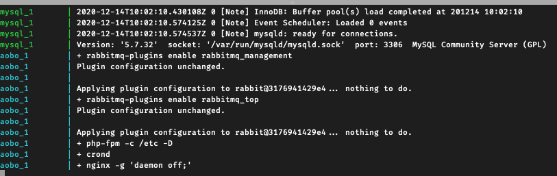
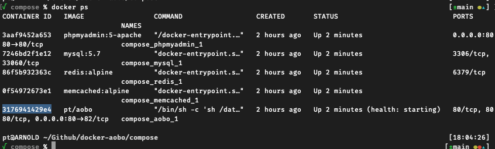
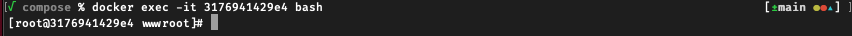

# 使用说明

使用了 Docker 工具集, 需要部署人员先熟悉 `docker` 命令.

## 目录说明

此目录中的主要文件说明. 

|目录|简要说明|
|-----|-----|
|`boot.sh`| 用于启动 docker 服务, 可以根据需要修改|
|`build.sh`| 用于创建 docker 镜像, 初始化执行一次. 如果 compose/Dockerfile 有修改, 需要重复执行|
|`compose/` | docker compose 主目录|
|`compose/Dockerfile`| 主要服务进程的镜像文件|
|`compose/docker-compose.yaml`| 服务进程组的描述文件 |
|`compose/packages`| 安装包(未使用)|
|`mount/` | 此目录为服务实例挂载的持久化目录, 服务进程的**配置文件**, **日志文件**, **MySQL** 数据库等都保存在这里.|

**注意**

**`mount/mysql`** 是 MySQL 数据文件, **需要做好备份**.  备份策略需要慎重考虑.

**`mount/etc/*`** 是各个服务进程的配置, 大部分可以复用到其他实例中. 

## 安装宿主依赖

需要安装 `docker` 和 `docker compose`

### 1. 安装 docker

参考 https://docs.docker.com/engine/install/centos/

```bash
sudo yum install -y yum-utils
sudo yum-config-manager \
    --add-repo \
    https://download.docker.com/linux/centos/docker-ce.repo
sudo yum install docker-ce docker-ce-cli containerd.io
```

启动
```bash
sudo systemctl start docker
```

### 2. 安装 docker compose 

参考 https://docs.docker.com/compose/install/

```bash
sudo curl -L "https://github.com/docker/compose/releases/download/1.27.4/docker-compose-$(uname -s)-$(uname -m)" -o /usr/local/bin/docker-compose
```
修改权限
```bash
sudo chmod +x /usr/local/bin/docker-compose
```

## 快速部署

### 1. **拷贝本目录到 目标机器.**

### 2. 构建 docker 镜像

```bash
sh build.sh
```

### 3. 启动 docker
```
sh boot.sh
```



启动 docker 需要对服务器进行初始化, 按照现有的施工文档执行初始化流程:

a. 查看当前 docker 实例的 ID

```bash
docker ps
```


b. 登录
```bash
docker exec -it 3176941429e4 bash
```


c. 拷贝代码到 /data/wwwroot/outbook 目录

c. 修改 .env 配置 

其中

```
DB_CONNECTION=mysql
```
```
REDIS_HOST=redis
```

e. 执行相关过程

```bash
cd /data/wwwroot/outbook
chmod -R 777 storage/
chmod -R 777 bootstrap/
composer install
composer update
php artisan key:generate
php artisan migrate
php artisan install:data 18569051349
## 等命令 ...
```

### 重启

```
docker-compose restart
```

已启动服务有
 
- 主服务 http://localhost:80 
- phpMyAdmin http://localhost:8080

### 配置 nginx

修改 /etc/nginx 中的内容

### 配置 php

修改 /etc/php.ini 中的内容

### 配置 mysql

参考  https://hub.docker.com/_/mysql  修改 `compose/docker-compose.yaml` 中 mysql 相关内容. 

### 配置 DNS
### 配置 https
### 更新代码
## 数据库维护

上述的几个过程可以参考原先文档
